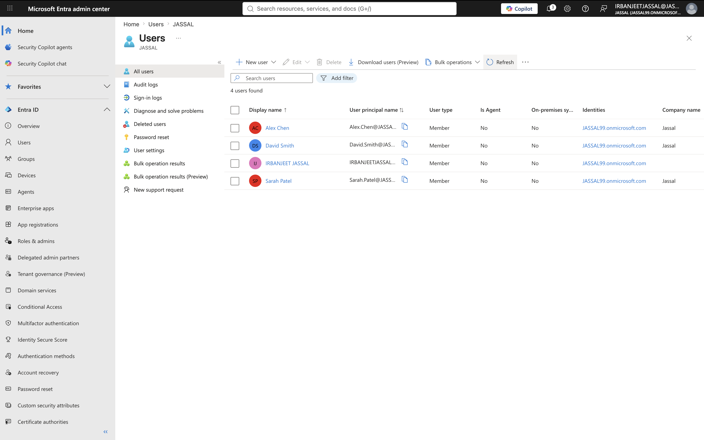
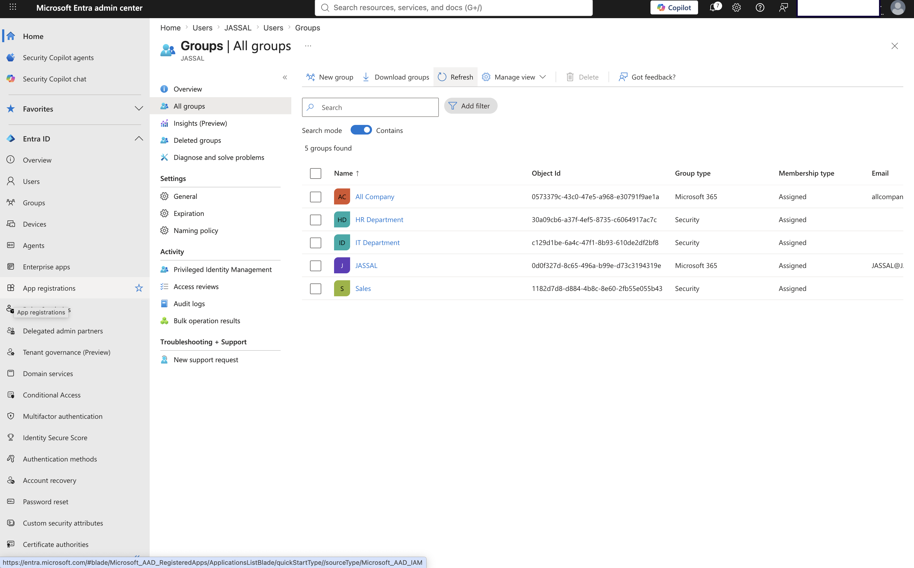
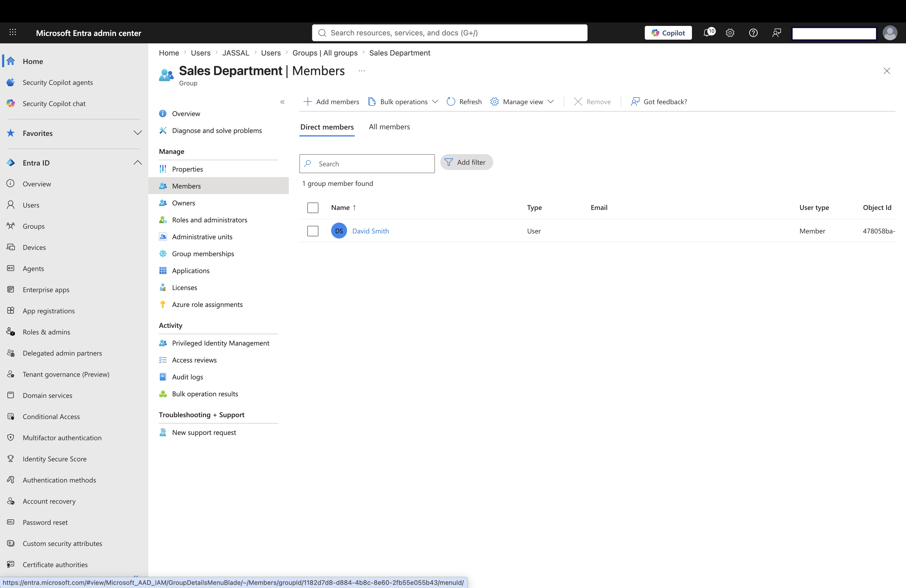
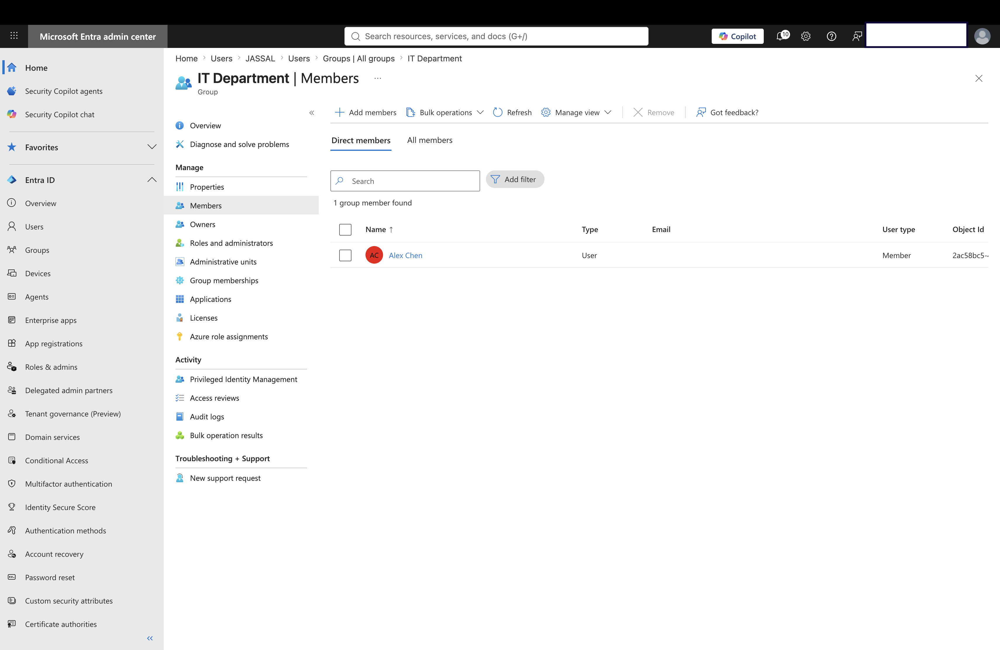
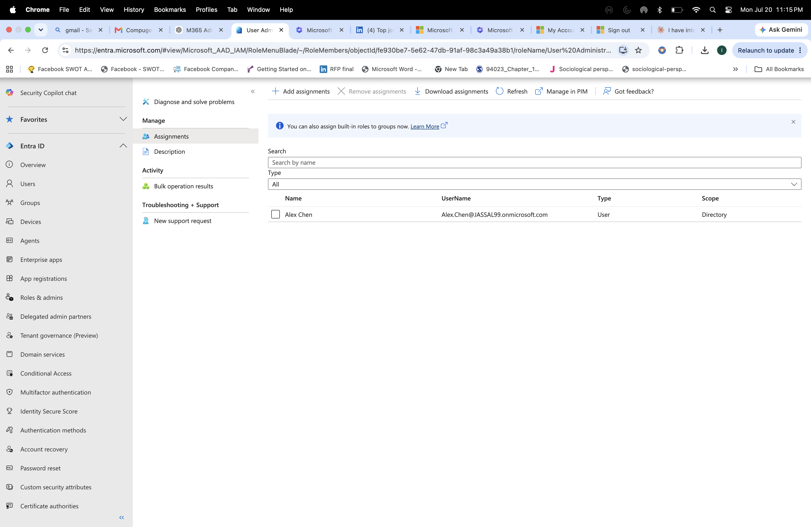
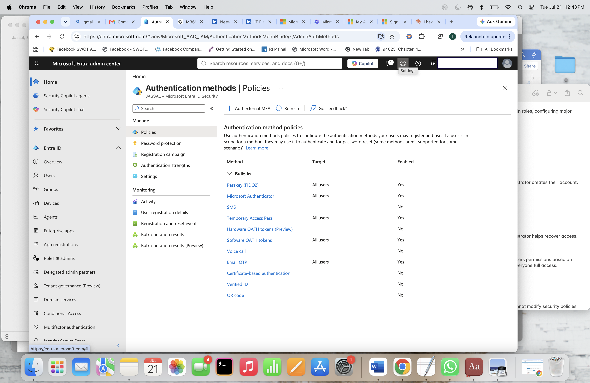

# Lab 1 - Microsoft Entra ID Identity Management

## Objective

Learn how to manage users, groups, role assignments, and authentication settings in Microsoft Entra ID.

---

## Business Scenario

As a Microsoft 365 Administrator, I need to manage user identities, organize users into groups, assign appropriate access, and review authentication configurations.

This lab demonstrates common identity administration tasks performed in a Microsoft Entra ID environment.

---

## Tasks Completed

### User Management

- Created and reviewed users in Microsoft Entra ID
- Explored user properties
- Verified account information

### Group Management

- Created security groups
- Assigned users to department-based groups
- Reviewed group memberships

Groups created:

- Sales Group
- IT Group
- HR Group

### Role Assignment

- Reviewed Microsoft Entra ID role assignments
- Explored administrator permissions

### Authentication Methods

- Reviewed authentication methods
- Explored identity security settings

---

# Screenshots

## Users

Created and managed users in Microsoft Entra ID.

---

## Groups

Created and reviewed Microsoft Entra ID groups.

---

## Sales Group Assignment

Assigned users to the Sales group.

---

## IT Group Assignment

Assigned users to the IT group.

---

## HR Group Assignment

Assigned users to the HR group.

---

## IT Role Assignment

Reviewed role assignments and administrator permissions.

---

## Authentication Methods

Reviewed authentication methods used for identity security.

---

# Key Learnings

- Learned how Microsoft Entra ID manages cloud identities.
- Practiced user creation and identity management.
- Learned how security groups simplify access management.
- Understood Role-Based Access Control (RBAC).
- Reviewed authentication methods used to secure user accounts.

---

# Skills Practiced

- Microsoft Entra ID
- Identity and Access Management (IAM)
- User Lifecycle Management
- Security Groups
- Role-Based Access Control (RBAC)
- Authentication Methods
- Microsoft 365 Administration

---

