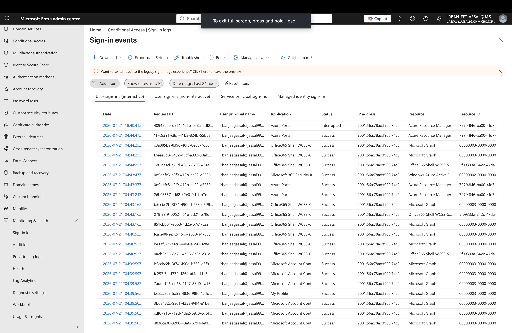

# Lab 2 - Microsoft Entra ID Conditional Access

## Objective

Configure and test a Microsoft Entra ID Conditional Access policy to improve identity security by requiring Multi-Factor Authentication (MFA).

---

## Business Scenario

An organization wants to protect Microsoft 365 resources by requiring users to verify their identity before accessing cloud applications.

As a Microsoft 365 Administrator, I need to configure Conditional Access policies and review sign-in activity to validate security controls.

---

# Tasks Completed

## Conditional Access Policy Configuration

- Created a Conditional Access policy in Microsoft Entra ID
- Selected target users/groups
- Configured cloud application access
- Enabled MFA requirement
- Reviewed policy settings

## Report-Only Mode Testing

- Configured the policy in Report-only mode
- Used sign-in logs to evaluate policy impact
- Verified how Conditional Access evaluates sign-ins

## Sign-in Log Review

- Reviewed user sign-in activity
- Checked authentication details
- Verified Conditional Access evaluation results

---

# Screenshots

## Conditional Access Policy

Created and configured a Conditional Access policy requiring MFA.

---

## Sign-in Logs

Reviewed sign-in logs to verify authentication and Conditional Access results.

---

# Key Learnings

- Learned how Conditional Access helps protect Microsoft 365 resources.
- Practiced creating policies based on users and applications.
- Understood the importance of Report-only mode before enforcing policies.
- Learned how sign-in logs help troubleshoot authentication issues.

---

# Skills Practiced

- Microsoft Entra ID
- Conditional Access
- Multi-Factor Authentication (MFA)
- Identity Security
- Sign-in Log Analysis
- Microsoft 365 Administration
