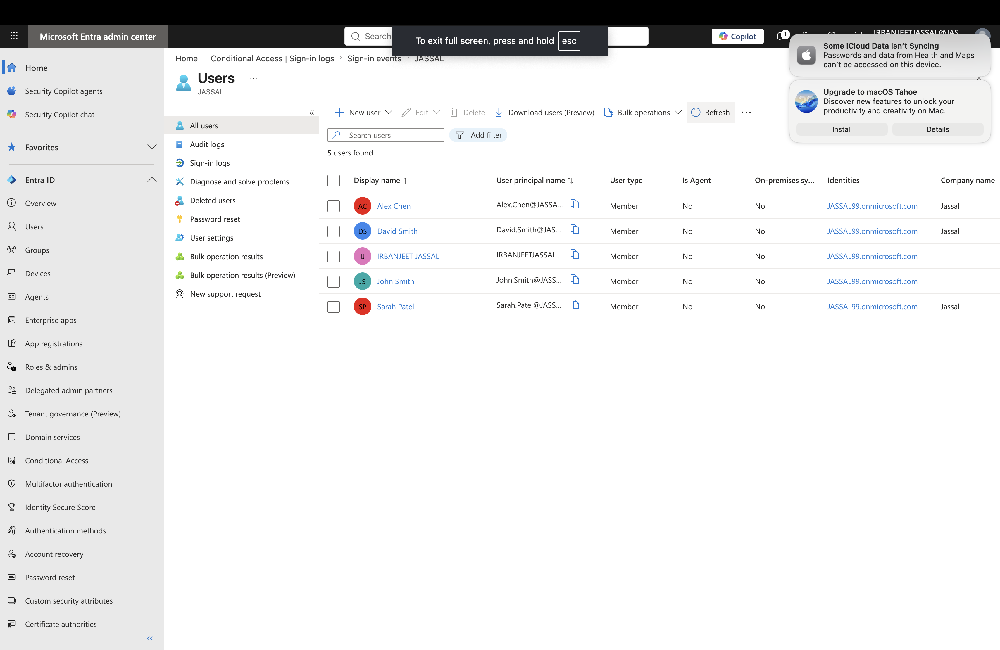
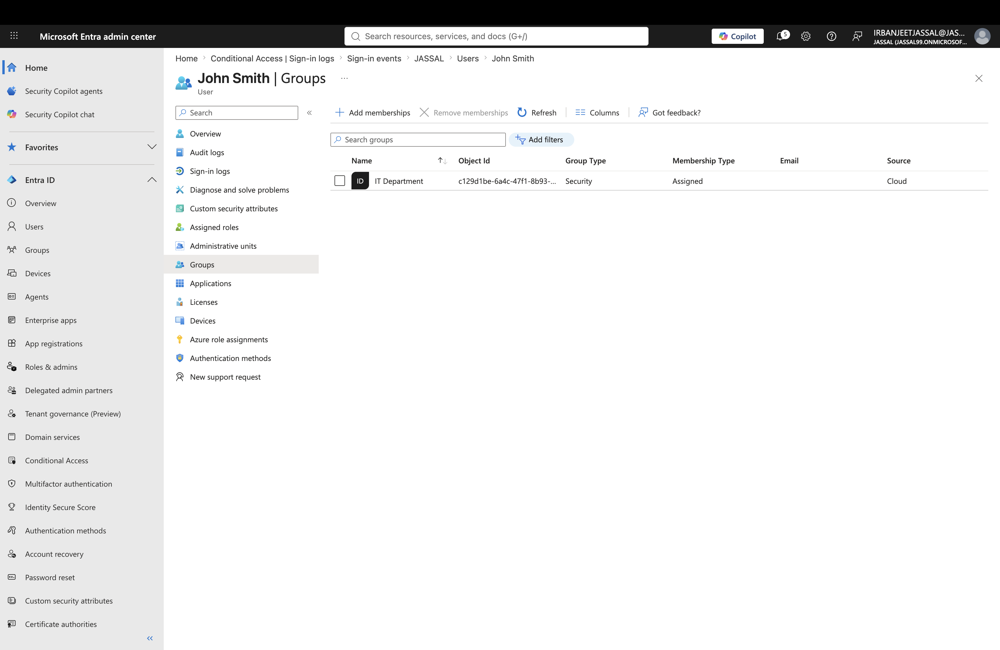
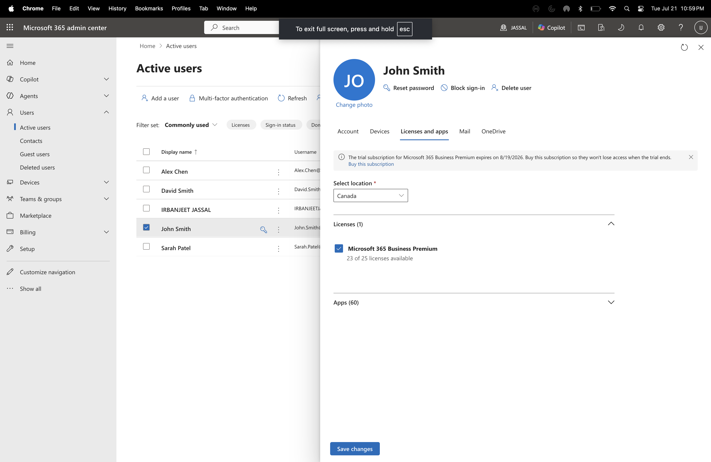
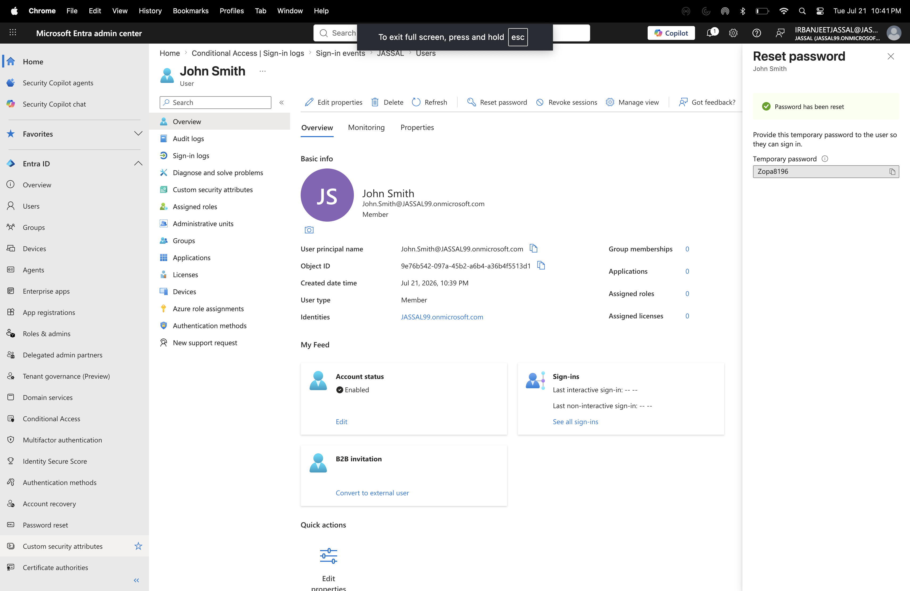
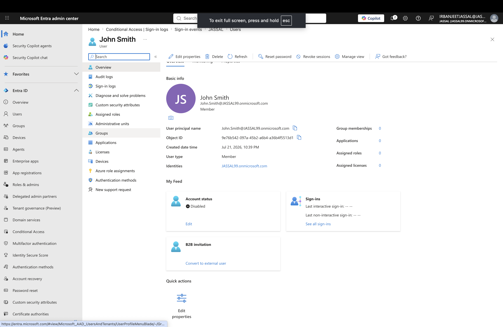
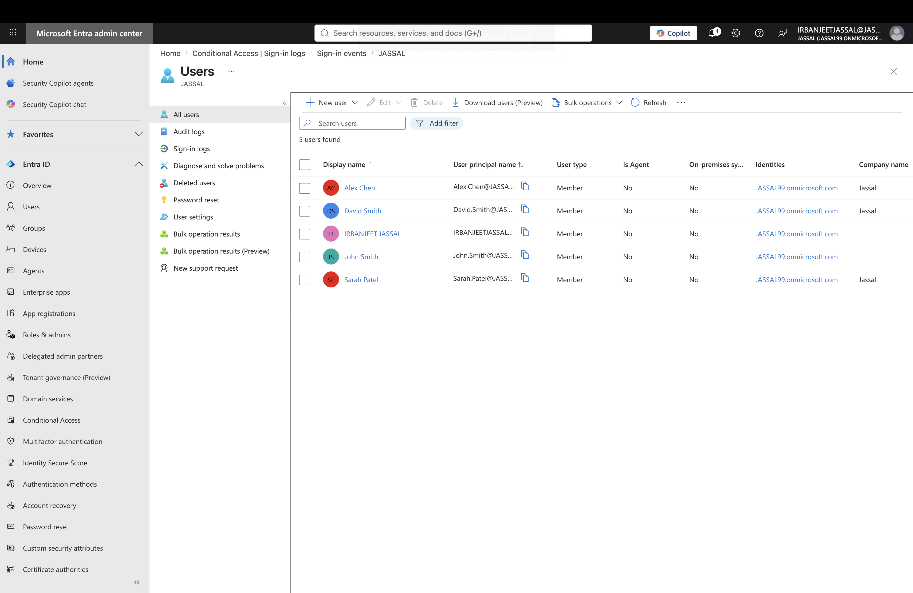

# Lab 3 - Microsoft Entra ID User Lifecycle Management

## Objective

Learn how to manage the complete user lifecycle in Microsoft Entra ID, including user creation, password management, group assignment, licensing, account disabling, deletion, and restoration.

---

## Business Scenario

As a Microsoft 365 Administrator, I am responsible for managing user accounts throughout their lifecycle.

This includes onboarding new employees, providing access to required resources, managing account changes, and handling employee departures.

---

# Tasks Completed

## User Creation

- Created a new user account in Microsoft Entra ID
- Verified user account details
- Confirmed successful account creation

## Password Management

- Reset user passwords
- Reviewed password management workflow

## Group Assignment

- Assigned users to security groups
- Managed access through group membership

## License Assignment

- Assigned Microsoft 365 licenses
- Reviewed license management options

## Account Management

- Disabled user accounts
- Deleted user accounts
- Restored deleted users

---

# Screenshots

## New User Created

Created a new user account in Microsoft Entra ID.

---

## Group Assignment

Assigned users to appropriate security groups.

---

## License Assignment

Assigned Microsoft 365 licenses to users.

---

## Password Reset

Reset a user's password through Microsoft Entra ID.

---

## Disabled Account

Disabled a user account to remove access while keeping the account available.

---

## Deleted User

Removed a user account from Microsoft Entra ID.

---

## Restore User

Restored a deleted user account.

---

# Key Learnings

- Learned how to manage users throughout the identity lifecycle.
- Practiced onboarding and offboarding processes.
- Understood how groups control access permissions.
- Learned how Microsoft 365 licenses are assigned.
- Practiced account recovery and restoration.

---

# Skills Practiced

- Microsoft Entra ID
- User Lifecycle Management
- User Administration
- Security Groups
- Microsoft 365 Licensing
- Identity and Access Management (IAM)
- Account Recovery

---
