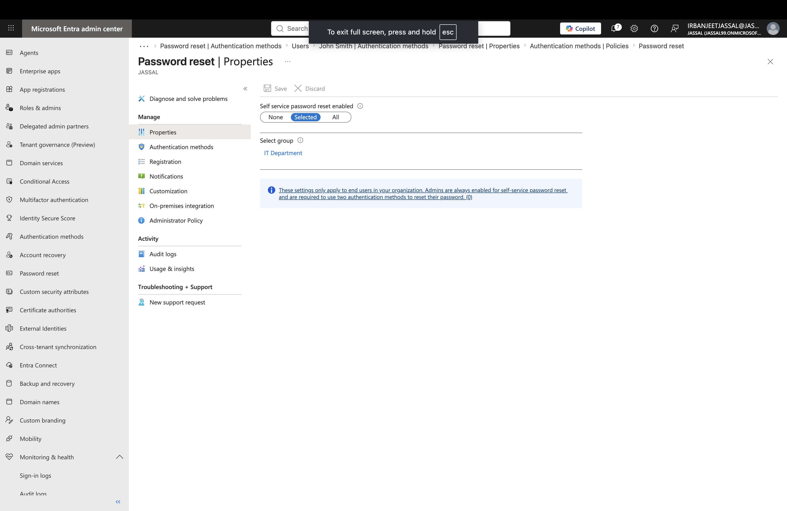

# Lab 4 - Microsoft Entra ID Self-Service Password Reset (SSPR)

## Objective

Configure and understand Microsoft Entra ID Self-Service Password Reset (SSPR) to allow users to securely reset their passwords without requiring administrator assistance.

---

## Business Scenario

In a Microsoft 365 environment, users may forget their passwords or get locked out of their accounts.

As a Microsoft 365 Administrator, I need to configure self-service password reset capabilities to improve user experience and reduce help desk workload.

---

# Tasks Completed

## Self-Service Password Reset Configuration

- Reviewed Microsoft Entra ID SSPR settings
- Explored password reset configuration options
- Learned how users can recover access to their accounts
- Reviewed authentication methods used for verification

---

# Screenshot

## Self-Service Password Reset Configuration

Configured and reviewed SSPR settings in Microsoft Entra ID.

---

# Key Learnings

- Learned how SSPR improves account recovery for users.
- Understood how administrators configure password reset policies.
- Learned the importance of authentication methods for identity verification.
- Understood how SSPR can reduce password reset requests to the help desk.

---

# Skills Practiced

- Microsoft Entra ID
- Self-Service Password Reset (SSPR)
- Authentication Methods
- Identity and Access Management (IAM)
- Microsoft 365 Administration
